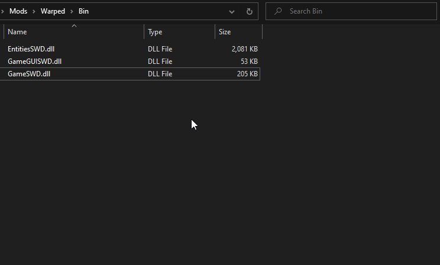

# Serious Sam Mod Launcher

This is an extremely simple and small utility for Serious Sam Classics modders (and players) that wish to launch any Serious Sam mod from its folder instead of launching the game first or manually writing launch scripts.

## How to use

1. Navigate to your Serious Sam installation directory, e.g. `C:\Program Files (x86)\Steam\steamapps\common\Serious Sam Classic The Second Encounter`.
2. Go to the `Mods` folder and then into any mod folder.
3. Go to mod's `Bin` folder (create one if it isn't there; this is purely optional).
4. Place `SamModLauncher.exe` into it and rename it into an executable from the game's `Bin` folder that should be launched.

### Demonstration

### Executable filename examples

| Filename inside mod's Bin folder | Matching command/script | Purpose |
| --- | --- | --- |
| `SeriousSam.exe` | `..\..\..\Bin\SeriousSam.exe +game <mod>` | For launching the game with the mod |
| `SeriousEditor.exe` | `..\..\..\Bin\SeriousEditor.exe +game <mod>` | For launching the world editor with the mod |
| `SeriousSam_Custom.exe` | `..\..\..\Bin\SeriousSam_Custom.exe +game <mod>` | For launching a different executable with the mod |
| `Bin_1.10@SeriousSam.exe` | `..\..\..\Bin_1.10\SeriousSam.exe +game <mod>` | For launching an executable under a different `Bin` directory |
| `@MySamApplication.exe` | `..\..\..\MySamApplication.exe +game <mod>` | For launching some other executable with the mod in the root game directory |

## Building

Project files are compatible with **Visual Studio 2010** and higher.

## License

**Serious Sam Mod Launcher** is licensed under the MIT license (see `LICENSE`).
